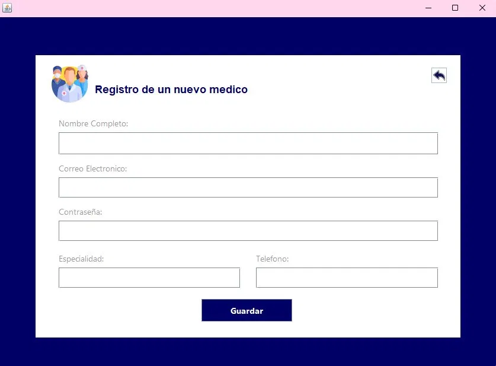
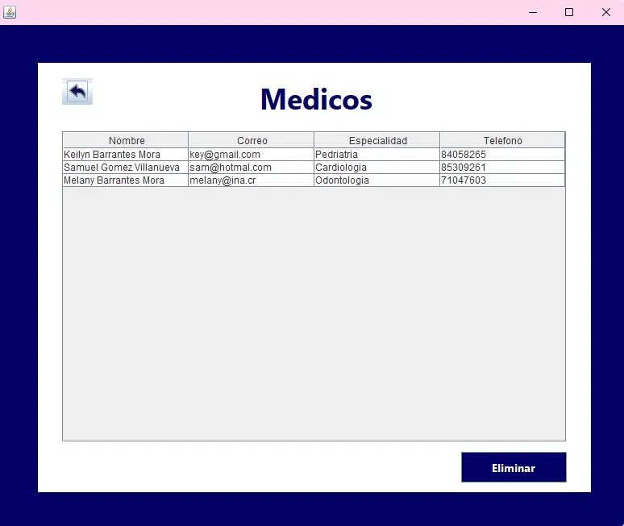
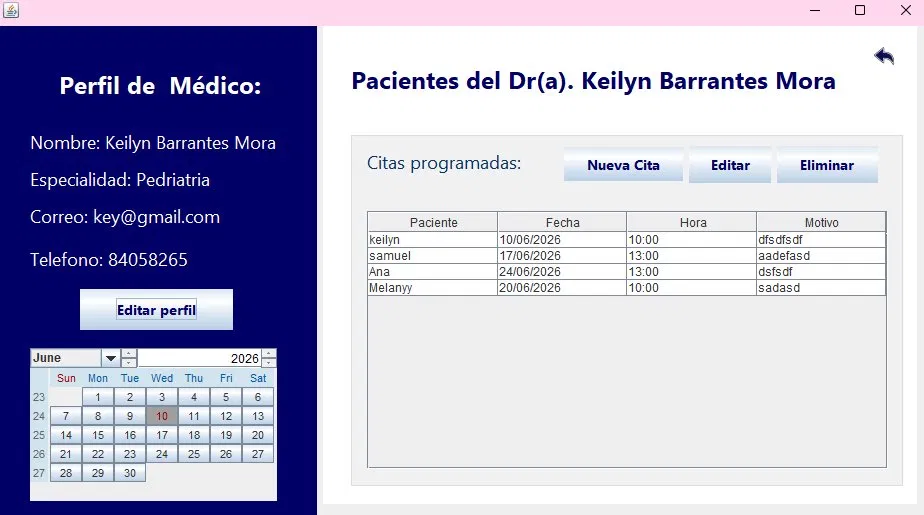
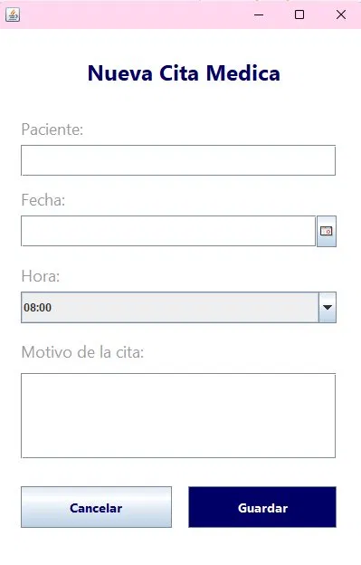

# Medical Appointment Management System

A desktop application developed in Java for the comprehensive management of medical appointments. The system allows doctors to log in, manage their profile, schedule appointments, and manage patient records through an intuitive graphical interface connected to a MySQL relational database.

---

## Features

- Doctor login with email and password authentication
- Doctor profile management (name, specialty, email, phone)
- Appointment scheduling with date, time, and reason
- Patient record management
- Edit and delete appointments
- Persistent data storage with MySQL relational database
- User-friendly desktop GUI built with Java Swing

---

## Technologies Used

| Technology | Version |
|------------|---------|
| Java SE | 21.0.2 |
| MySQL | 8.0.45 |
| JDBC | MySQL Connector/J |
| IDE | NetBeans |

---

## Prerequisites

Make sure you have the following installed before running the project:

- [Java JDK 21+](https://www.oracle.com/java/technologies/downloads/)
- [MySQL 8.0+](https://dev.mysql.com/downloads/)
- [NetBeans IDE](https://netbeans.apache.org/front/main/index.html)
- [MySQL Connector/J](https://dev.mysql.com/downloads/connector/j/) (JDBC Driver)

---

## Database Setup

1. Open **MySQL Workbench** and connect to your local server
2. Open a new query tab and run the SQL script located in the `/database` folder:
```sql
-- Run this file:
database/citas_medicas.sql
```
3. This will create the `citas_medicas` database and all required tables
---

## Installation & Run

1. Clone the repository:
```bash
git clone https://github.com/keybm24/Medical_Appointment_Managemen_System-.git
```
2. Open the project in **NetBeans IDE**:
   - File → Open Project → Select the cloned folder
3. Configure the database connection:
   - Locate the database connection file in the project
   - Update the following credentials with your MySQL details:
```java
   String url = "jdbc:mysql://localhost:3306/citas_medicas";
   String user = "root";
   String password = "YOUR_PASSWORD";
```
4. Add the MySQL Connector/J to the project libraries:
   - Right-click the project → Properties → Libraries → Add JAR/Folder
   - Select the `mysql-connector-j-x.x.x.jar` file
5. Run the project:
   - Press **F6** or click the **Run** button in NetBeans
---

## Usage

1. Launch the application
2. On the login screen, enter your doctor email and password
3. Once logged in you can:
   - View and edit your doctor profile
   - See your scheduled appointments in the calendar
   - Add new appointments with patient name, date, time, and reason
   - Edit or delete existing appointments
4. Use the **"Agregar Médico"** button to register new doctors
5. Use the **"Ver Médicos"** button to view and manage the doctor list

---

## Project Structure

```
GestionCitasMedicas/
│
├── src/
│   ├── dao/
│   │   ├── CitasDAO.java          # Data access object for appointments
│   │   ├── Conexion.java          # Database connection configuration
│   │   └── MedicoDAO.java         # Data access object for doctors
│   │
│   ├── img/
│   │   ├── flecha.png             # UI arrow icon
│   │   ├── logo.png               # Application logo
│   │   └── logomedico.png         # Doctor icon
│   │
│   ├── interfaces/
│   │   ├── Gestionable.java       # Interface for CRUD operations
│   │   └── Persona.java           # Base interface for persons
│   │
│   ├── main/
│   │   └── Main.java              # Application entry point
│   │
│   ├── modelos/
│   │   ├── Citas.java             # Appointment model
│   │   ├── Medico.java            # Doctor model
│   │   └── Paciente.java          # Patient model
│   │
│   └── vistas/
│       ├── EditarPerfil.java      # Edit doctor profile screen
│       ├── NuevaCita.java         # New appointment screen
│       ├── PerfilMedico.java      # Doctor profile & appointments screen
│       ├── RegistroMedico.java    # Doctor registration screen
│       ├── VentanaPrincipal.java  # Main login screen
│       └── VerMedico.java         # View doctors screen
│
├── database/
│   └── citas_medicas.sql          # SQL script to set up the database
│
└── README.md
```

## Screenshots

| Login Screen | Doctor Registration | View Doctors |
|---|---|---|
|  |  |  |

| Doctor Profile & Appointments | New Appointment |
|---|---|
|  |  |

---

## Author

**Keilyn Barrantes Mora**  
keybarmor24@gmail.com  
[LinkedIn](https://www.linkedin.com/in/keybarrantes242003/)  
[GitHub](https://github.com/keybm24)
